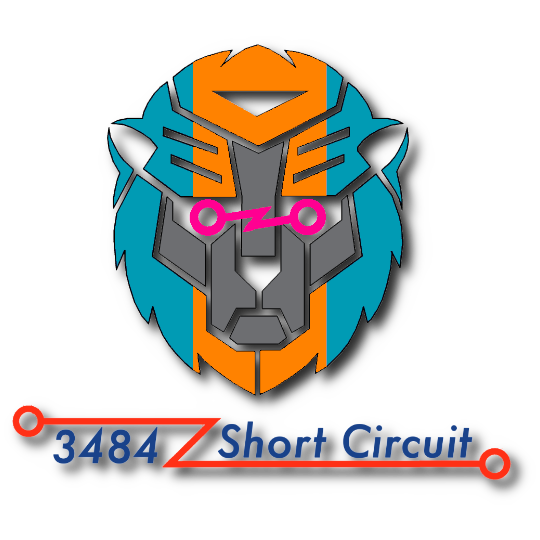

<div align="center">

  

  <h1>X25 Robot Code</h1>

  **This repository holds 3484's robot code for the 2025 Reefscape season**

  **[Branches](https://github.com/FRC-Team3484/X25_RobotCode/branches)** ● **[Documentation](#documentation)**

</div>

## Installation
> [!NOTE]
> **This project uses WPILib 2025.2.1 and includes needed vendor dependencies**

First, download the [2025.2.1 Release of WPILib](https://github.com/wpilibsuite/allwpilib/releases/tag/v2025.2.1) and install it to your computer.

Next, clone this repository
```
git clone https://github.com/FRC-Team3484/X25_RobotCode
```
Now, open the WPILib VSCode that you just installed and navigate to the `X25_RobotCode` folder. Open the command palette (`Ctrl-Shift-P`) and run the `WPILib: Build Robot Code` command

Source control and WPILib tools and functionality should both be avaliable in this directory

## Documentation
This repo contains several pieces of documentation which may be useful throughout the season or in the future. Some of these are repo specific and some are from [FRC-Team3484/programming-lists](https://github.com/FRC-Team3484/programming-lists)

- **[Repository Good Practices](docs/Repository_Good_Practices.md)**
  - [Branches](docs/Repository_Good_Practices.md#branches)
  - [Merging Branches](docs/Repository_Good_Practices.md#merging-branches)
- **[Code Style Guide](docs/Code_Style_Guide.md)**
  - [Cases](docs/Code_Style_Guide.md#cases)
  - [Formatting](docs/Code_Style_Guide.md#formatting)
  - [File Names](docs/Code_Style_Guide.md#file-names)
  - [Other](docs/Code_Style_Guide.md#other)
- **[Commenting Guide](docs/Commenting_Guide.md)**
- **[How to Use Git](docs/How_to_Use_Git.md)**
- **[C++ Learning](docs/C++_Learning.md)**
- **[Useful Documentation](docs/Useful_Documentation.md)**