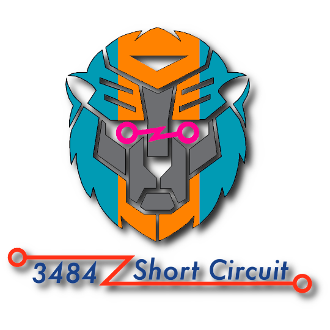

<div align="center">

  

  <h1>X25 Robot Code</h1>

  **This repository holds 3484's robot code for the 2025 Reefscape season**

  **[Branches](https://github.com/FRC-Team3484/X25_RobotCode/branches)** ● **[Documentation](#documentation)**

</div>

## Installation

First, clone this repository
```
git clone https://github.com/FRC-Team3484/X25-RobotCode
```
Next, open the WPILib VSCode and navigate to the `X25_RobotCode` folder. Open the command palette (`Ctrl-Shift-P`) and run the `WPILib: Build Robot Code` command

You can use Git: Open Repository and select the `X25_RobotCode` parent folder to enable the Git tools inside of VSCode, while still being able to build and run the code

## Documentation
This repo contains several pieces of documentation which may be useful throughout the season or in the future. Some of these are repo specific and some are from [FRC-Team3484/programming-lists](https://github.com/FRC-Team3484/programming-lists)

- **[Repository Good Practices](docs/Repository_Good_Practices.md)**
  - [Branches](docs/Repository_Good_Practices.md#branches)
  - [Merging Branches](docs/Repository_Good_Practices.md#merging-branches)
- **[How to Use Git](docs/How_to_Use_Git.md)**
- **[C++ Learning](docs/C++_Learning.md)**
- **[Useful Documentation](docs/Useful_Documentation.md)**